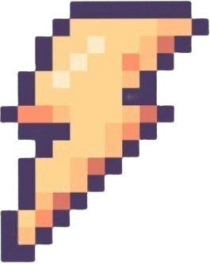
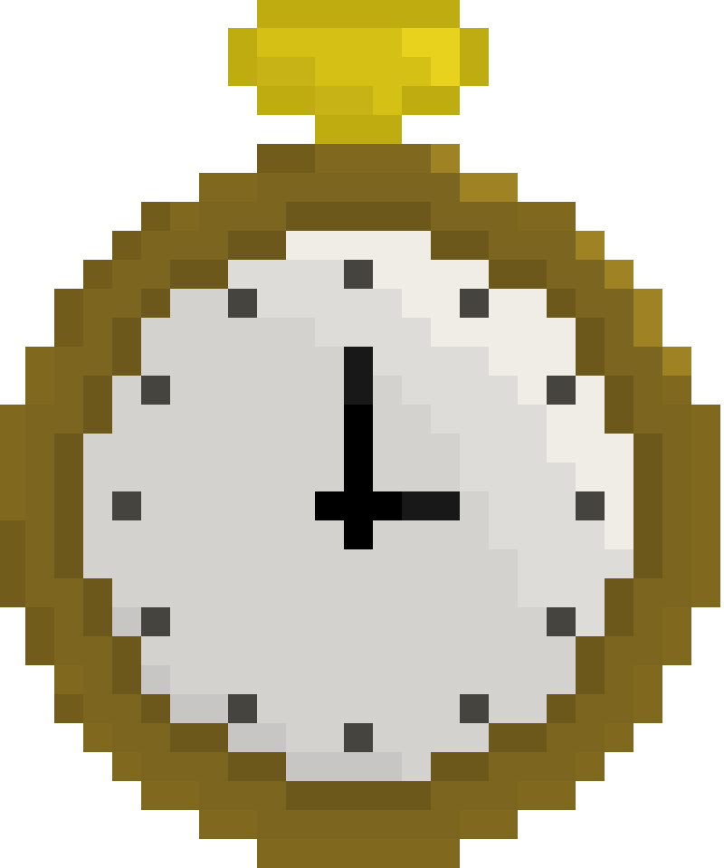

## 💣 Avoiding-Bomb 

> 성공회대학교 2024-2학기 오픈소스SW개발 Team Delta  
> 개발 기간: 2024.09 ~ 2024.12 

## 📑 목차
- [개요](#개요)
- [게임 시작 가이드](#게임-시작-가이드)
- [게임 플레이 방식](#게임-플레이-방식)

## 개요
- 프로젝트 이름: **Avoiding-Bomb**
- 프로젝트 개발 기간: **2024.09 ~ 2024.12**
- 개발 환경 및 언어  
           

- Team: **Delta**([박주원](https://github.com/juwon02), [이정혁](https://github.com/likevanilla), [이진](https://github.com/jine531), [최다연](https://github.com/choi-day))

  
## 게임 시작 가이드

### 깃허브에서 fork 및 clone
+ 올라온 코드를 자신의 깃허브에 fork 후 로컬에 clone한다.

### Visual Studio

Visual Sudio 다운로드
  
  
1. [Visual Studio](https://visualstudio.microsoft.com/ko/)사이트에서 Visual Studio를 다운로드한다.

2. Visual Stdio에서 git hub에서 clone한 코드를 열어본다.

### pygame

pygame 다운로드

1. Visual Studio 터미널 창을 연다.

2. pygame을 설치하기 위해 아래의 명령어를 입력한다.

         pip install pygame

### 게임 실행

1. bomb_game 파일에서 bomb_game.py를 선택한 후 상단 메뉴에서 RUN-> Start Without Debugging을 선택한다.

## 게임 플레이 방식

|시작화면이미지|플레이화면이미지|
|:---:|:---:|
|시작 화면|플레이 화면|

### 캐릭터 이동 방법

|이동방향|왼쪽(좌)|오른쪽(우)|
|:---:|:---:|:---:|
|방향키|⬅️|➡️|

### 🔜 인트로 

- `Start` 버튼을 누르면 게임이 시작됩니다.   
- `Quit` 버튼을 누르면 게임을 종료합니다.

### 🔛 게임 플레이 

### ➕
|번개|별|시계|하트|
|:---:|:---:|:---:|:---:|
|||||
|캐릭터의 이동속도가 빨라집니다.|잠시동안 폭탄과 충돌하지 않습니다.|잠시동안 폭탄의 낙하 속도를 늦춥니다.|생명을 1개 추가해줍니다.|

### ➖
|폭탄|다이너마이트|거북이|
|:---:|:---:|:---:|
||||
|생명이 1개 깎입니다.|생명이 2개 깎입니다.|캐릭터의 이동속도가 느려집니다.|

### 🔚 게임 종료 

- 살아남은 시간으로 자신만의 기록을 세워보세요!   
- `RE?` 버튼을 누르면 게임이 재시작됩니다.   
- `Quit`  버튼을 누르면 게임을 종료합니다.

## License

This project is licensed under the terms of the [MIT license](./LICENSE).
